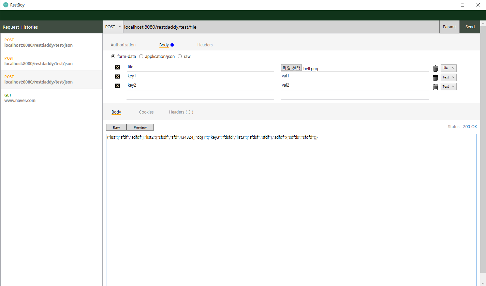

## RestBoy 
### Overview
**RestBoy** is an application written in c#(WPF) to support to test http protocols especially rest api  
Inspired by POSTMAN for Chrome.

### Features
- Send _GET_, _POST_, _PUT_, _DELETE_ requests 
- With a gui json editor, you can save your time easily
- It is support to uploading base64-encoded file using rest api
- It is support form-data, application/json and url params
- Customize http header if you want

### Downloads
###### https://1drv.ms/u/s!AmGzude4yUWtiqdpkXxz0h-RRv-20A

### Usage

##### Main window

- Request Histories: holds your http request when you send
- Authorization: until now, not supported
- Body(Upper side): Supports Json, form data, and raw text respectively.
- Headers: currently in progress

##### GUI JSON Editor

- Easily create json body message with a gui json editor
- Convert file to base64-encoded string

##### Form-Data Editor

### License
